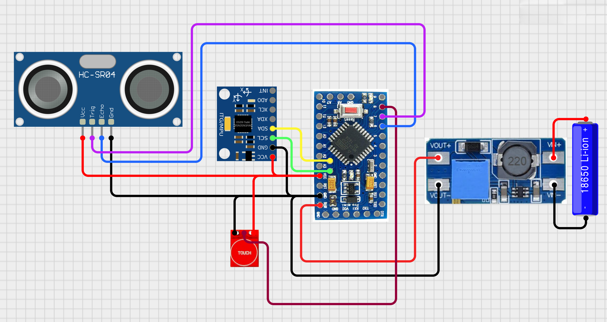

# 📐 Smart Measurement Device (ESP8266/Arduino + MPU6050 + Ultrasonic + OLED)

A multifunction **measurement tool** built around Arduino/ESP-compatible hardware.  
This project integrates **distance measurement**, **angle measurement**, and a **digital spirit level**, displayed on an **OLED screen**, with calibration values stored in **EEPROM** for persistent accuracy.

---

## 🚀 Features
- **Ultrasonic Distance Measurement**  
  - Uses an ultrasonic sensor (HC-SR04) to measure distance in centimeters.  
  - Displays value + progress bar on OLED.

- **Angle Measurement (Protractor Mode)**  
  - Uses MPU6050 IMU (accelerometer + gyroscope).  
  - Real-time line indicator shows the tilt angle.  
  - Positive tilt lifts from the right, negative tilt lifts from the left.  
  - Calibrated values persist after reset (stored in EEPROM).

- **Digital Spirit Level (Bubble Level Mode)**  
  - 2D roll and pitch visualization.  
  - Shows movement of a circle (bubble) inside a rectangle.  
  - Helps check surface alignment.

- **Calibration Mode**  
  - Tilt the device to ±40° to enter calibration.  
  - Place on a flat surface to auto-calibrate.  
  - Saves offsets (roll, pitch, angle) in EEPROM.  
  - No need to recalibrate every power cycle.

- **User Interface**  
  - Modes are selected via a touch switch.  
  - Mode cycles between:  
    1. Distance  
    2. Angle  
    3. Spirit Level  
    4. Calibration

---

## 🛠️ Hardware Used
- **MCU**: Arduino (tested on Uno / ESP8266, works on STM32 too with minor tweaks)  
- **IMU**: MPU6050 (Accelerometer + Gyroscope)  
- **Display**: 128×64 OLED (SSD1306 over I²C)  
- **Sensor**: Ultrasonic Sensor (HC-SR04)  
- **TTP223 touch sensor**: For mode switching  
- **EEPROM**: Built-in (Arduino) to store calibration offsets  

---

## 🔌 Circuit Connections

| Component        | Pin (Arduino)   |
|------------------|-----------------|
| OLED (SDA, SCL)  | A4, A5 (I²C)    |
| Ultrasonic Trig  | D7              |
| Ultrasonic Echo  | D6              |
| TTP223 switch    | D8              |
| MPU6050 (SDA,SCL)| A4, A5 (I²C)    |

*(Adjust pins if using ESP8266 or STM32.)*

---


## ⚛⚡⏚⎍ ⎓ ⎶  Circuit Digram 



---

## 📲 Installation & Setup
1. Clone this repository:
   ```bash
   git clone https://github.com/deepak-verma-301/measurement_device.git
